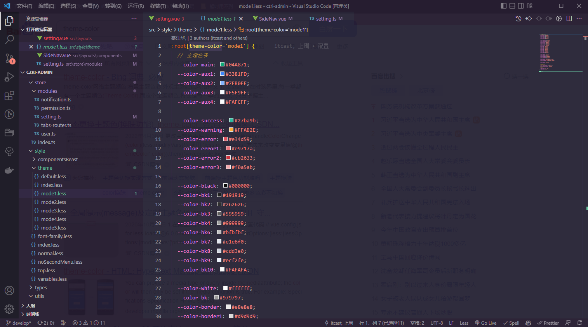
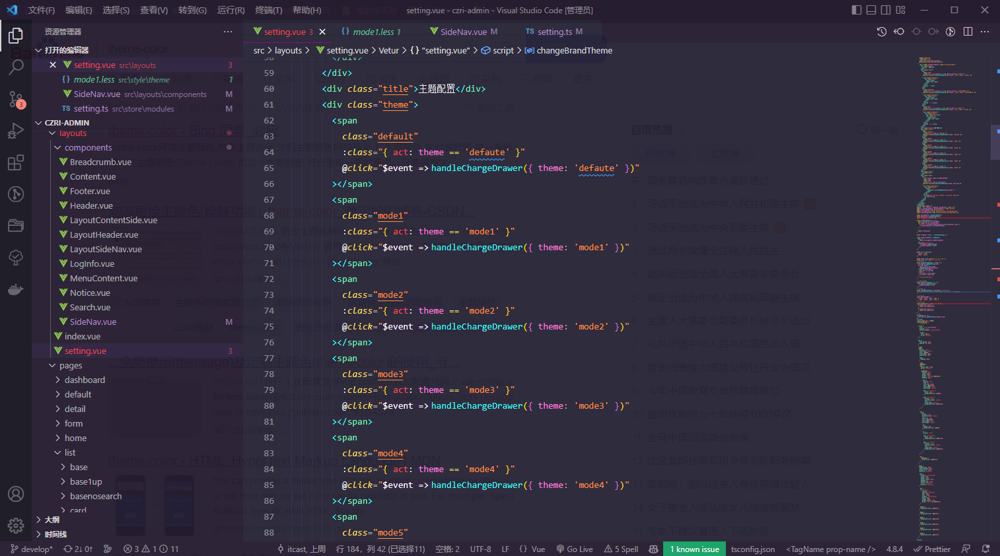
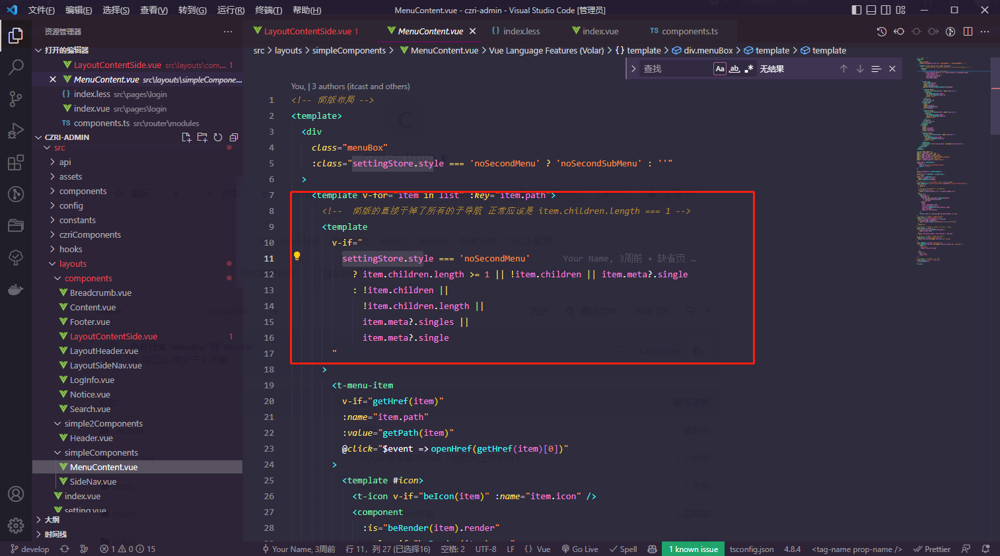
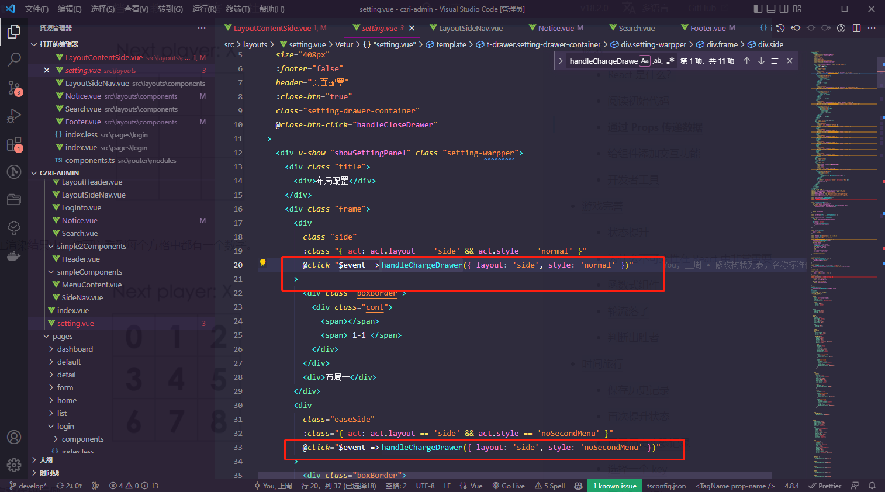
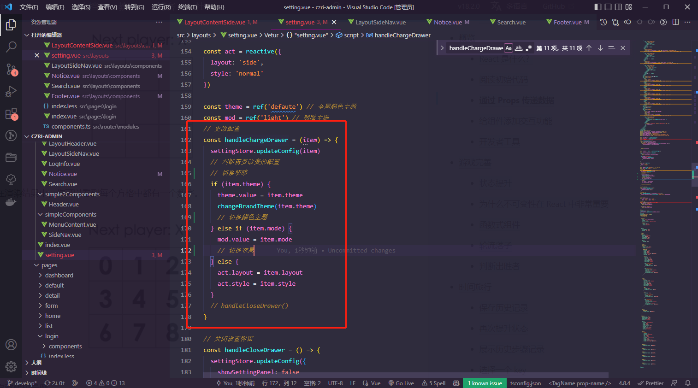
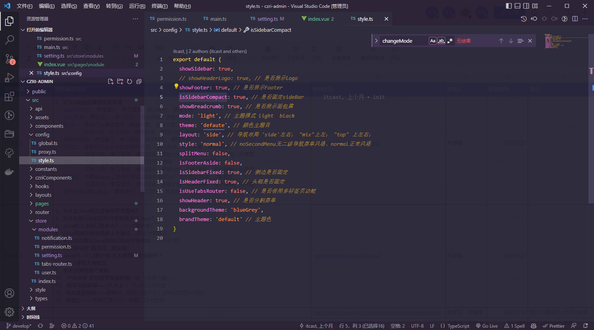
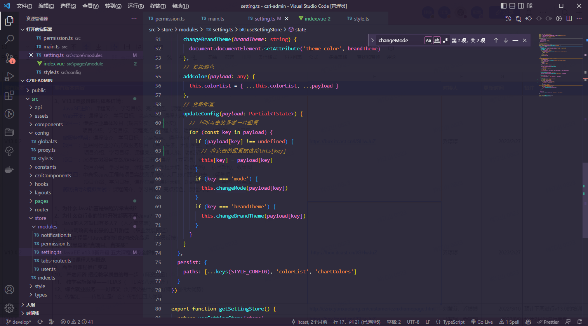
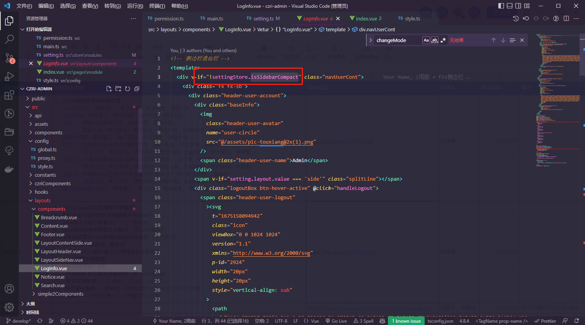

# RDesign

#### 链条式组件库
- 平时项目开发中，遇到已有组件库中没有涉及的组件但又经常用到，每次都得重新开发很浪费时间，针对这个问题我们进行了二次组件封装或者是重新开发，用的时候直接引入

#### 技术栈
- Vue 3 + TypeScript +Tdesign + Vite + pinia

#### 运行环境 - 初始开发环境及工具
- Mac
- node v17.8.0
- pnpm 6.32.8
- npm v8.12.1

#### 文件架构

```
├── commitlint.config.js              - commintlint 规范
├── docker                            - docker 部署配置文件
│     └── nginx.conf                  - 若开启 browerhistroy 可参考配置
├── docs                              - 项目展示图 - 首页截图      
├── globals.d.ts                      - 通用声明文件        
├── index.html                        - 主 html 文件
├── mock                              - mock 目录
│     └── index.ts
├── node_modules                      - 项目依赖
├── package-lock.json
├── package.json
├── public                            - 公用资源文件  
│     └── favicon.ico
├── shims-vue.d.ts
├── src                               - 页面代码
│   ├── api 请求相关
│   ├── assets 公共资源
│   │   ├── images 图片资源
│   ├── api                           - 接口
│   ├── co nponents                    - 公用组件
│   │   ├── Delete                    - 删除弹层：只需从父组件传删除的内容提示
│   │   ├── ImageMagnify              - 查看图片弹层
│   │   ├── Message                   - 提示弹层
│   │   │   ├──Success                - 成功通知弹窗
│   │   │   ├──ProdDisabled           - 禁用提示弹窗
│   │   ├── switchBar                 - tab切换
│   │   │   ├──switchBar              - tab切换
│   │   │   ├──switchBarindex         - 首页tab切换
│   │   │   ├──switchBartop           - 线条tab
│   ├── czriComponents                - 组件包：常用，但是原有组件库实现不了，因此进行了二次开发
│   │   ├──AddInput                   - 动态添加input组件
│   │   ├──CardListCollapse           - 折叠列表
│   │   ├──CardListSort               - 带排序的列表
│   │   ├──dropList                   - 可下拉展开的列表
│   │   ├──ListDialog                 - 常用弹窗5（带列表的弹窗）
│   │   ├──ListScrollDialog           - 常用弹窗5（带列表的弹窗、滚动分页）
│   │   ├──tabsDialog                  - 常用弹窗6（带tab的弹窗）
│   │   ├──tabList                    - 带tab的列表
│   │   ├──Transfer                   - 穿梭框(标题有hover状态)
│   │   ├──treeList                   - 树形列表
│   │   ├──unitsDialog                 - 常用弹窗2（带单位和数显）
│   │   ├──index.less                 - 组件包样式
│   ├── layouts                       - 页面架构
│   │   ├──components				  - 页面架构公共组件
│   │   │   ├──Breadcrumb			  - 面包屑
│   │   │   ├──Content				  - 内置组件，避免重复渲染DOM
│   │   │   ├──Footer				  - 底部公司名称
│   │   │   ├──LayoutContentSide	  - 侧边栏
│   │   │   ├──LayoutHeader	  		  - 侧边栏头部
│   │   │   ├──Loginfo	  		  	  - 侧边栏退出区域
│   │   │   ├──Notice	  		  	  - 通知中心，弃用
│   │   │   ├──Search	  		  	  - 搜索功能
│   │   ├──frame					  - 页面架构框架
│   │   ├──simple2Components		  - 框架二公用内容
│   │   │   ├──Header				  - 框架顶部
│   │   ├──simpleComponents		  	  - 框架公用内容
│   │   │   ├──MenuContent	  		  - 简版布局
│   │   │   ├──SideNav	  		  	  - 列表菜单
│   │──index.vue					  - 框架布局
│   │──setting.vue					  = 设置框架风格
│   ├── pages                         - 页面展示目录
│   │   ├──dashboard                  - 首页
│   │   ├──detail                     - 详情页
│   │   │   ├──advanced               - 多卡片详情页
│   │   │   ├──base                   - 基础详情页
│   │   │   ├──deploy                 - 数据详情页
│   │   │   ├──secondary              - 二级详情页
│   │   ├──form                       - 表单页
│   │   │   ├──base                   - 基础表单页
│   │   │   ├──step                   - 分步表单页
│   │   ├──login                      - 普通tab登录页
│   │   ├──login2                     - 左右布局登录页
│   │   ├──module                     - 组件包调用入口页，调用的组件都在(czriComponents文件加中)
│   │   ├──user                       - 个人中心
│   │   ├──list                       - 列表页
│   │   │   ├──base                   - 基础列表页
│   │   │   ├──upBase                - 基础列表页（带图）
│   │   │   ├──noSearch           - 基础列表页（不带搜索）
│   │   │   ├──card                   - 卡片列表页
│   │   │   ├──noData                 - 列表无数据页
│   │   │   ├──statistics             - 统计数据列表页
│   │   │   ├──tab                    - tab切换
│   │   │   ├──Toptab                 - 标签列表页（顶部）
│   │   │   ├──tree                   - 树状筛选列表页
│   ├── router                        - 定义路由页面
│   ├── style                         - 样式
│   │   ├──componentsReast            - 组件重置、全局样式
│   │   ├──theme                      - 全局颜色值、公用样式
│   │   index.less                    - 样式总入口
│   │   normal.less                   - 普通框架样式
│   │   noSecondMenu.less             - 普通框架简化版样式
│   │   top.less                      - 上左右布局
│   ├── utils       封装工具目录
│   ├── main.ts						  - 项目入口文件
│   ├── permission.ts				  - 路有权限控制
├── tsconfig.json                     - ts配置文件
├── README.md                         - 说明文档  
└── vite.config.js                    - vite 配置文件
```

#### 运行

``` bash
## 安装依赖
npm install	|| yarn

## 启动项目

## 启动链接mock
npm run dev

## 启动链接测试环境
npm run start
```

### 构建

```bash
## 构建正式环境 - 打包
npm run build

```

#### 插件
- [nprogress 进度条 ](https://madewith.cn/23)  
- [viteMockServe vite 的数据模拟插件](https://www.csdn.net/tags/MtTaMg1sODE4ODA3LWJsb2cO0O0O.html)
- [vueJsx ](https://zhuanlan.zhihu.com/p/460328418)
> 使用jsx 语法 jsx语法可以更好地跟Typescript结合 在阅读UI框架源码时，发现在知名UI组件库Ant Design Vue跟Naive UI皆使用tsx语法开发
- [vite-svg-loader](https://www.jianshu.com/p/bd3835d17ad1)

#### 参考
- [vite](https://vitejs.cn/guide/#index-html-and-project-root)
- [vue3](https://v3.cn.vuejs.org/guide/introduction.html)
- [pinia 中文文档 :类vuex](https://pinia.web3doc.top/introduction.html#%E4%B8%BA%E4%BB%80%E4%B9%88%E8%A6%81%E4%BD%BF%E7%94%A8-pinia%EF%BC%9F) 
- [vue-router](https://router.vuejs.org/zh/guide/)
- [Tdesign](https://tdesign.tencent.com/vue-next/getting-started)
- [Tdesign-cli](https://tdesign.tencent.com/starter/docs/vue-next/get-started)
- [pnpm](https://zhuanlan.zhihu.com/p/404784010)
#### 配置文件
- [.prettierrc vscode自动格式化插件配置](https://github.com/prettier/prettier)
- [.eslintrc eslint配置文件](https://cn.eslint.org/docs/rules/)
- [tsconfig.json 配置整理](https://wenku.baidu.com/view/1fc27fe29dc3d5bbfd0a79563c1ec5da50e2d6bd.html)
- [vite.config.js vite配置文件](https://vitejs.cn/config/)


#### 兼容性

| [](http://godban.github.io/browsers-support-badges/)</br> IE / Edge | [](http://godban.github.io/browsers-support-badges/)</br>Firefox | [](http://godban.github.io/browsers-support-badges/)</br>Chrome | [](http://godban.github.io/browsers-support-badges/)</br>Safari |
| ---------------------------------------------------------------------------------------------------------------------------------------------------------------------------------------------------------------- | ----------------------------------------------------------------------------------------------------------------------------------------------------------------------------------------------------------------- | ------------------------------------------------------------------------------------------------------------------------------------------------------------------------------------------------------------- | ------------------------------------------------------------------------------------------------------------------------------------------------------------------------------------------------------------- |
| Edge >=84                                                                                                                                                                                                        | Firefox >=83                                                                                                                                                                                                      | Chrome >=84                                                                                                                                                                                                   | Safari >=14.1                                                                                                                                                                                                  |

### 组件概览

框架上，当前此组件库共包含

三套框架

六套主题

两种模式

页面上，当前共包含

列表页9个，包含列表（基础）、列表（带图）、列表（无搜索）、列表（Tab切换列表）、列表（Tab切换页面）、列表（关键数据）、列表（卡片式）、列表（树状筛选）、列表（无数据）等九个列表，位于page下面的list文件夹

表单页1个，分布表单页，位于page下的form文件夹下的step文件夹

个人页1个，位于page下的user文件夹

缺省页共5个，包含服务器出错页、网络异常页、网络断开页、访问页面不存在、无权限页，位于page下的default文件夹

组件共11个，包含列表（可排序）、列表（可展开1）、列表（可展开2）、列表（带Tab）、列表（树状）、弹窗（带列表）、弹窗（带Tab）、弹窗（带表单）、禁用提示、动态增加数据、穿梭框。展示位于page文件夹下的module文件夹，具体每个组件源代码位于src下的czriComponents文件夹下。

### 关于如何使用框架进行修改使用

#### 如何增加和修改主题颜色

原理：该组件库的主题颜色的修改主要是通过更改全局应用的less文件来达成换肤的目的，及点击换色时，当前应用的样式文件发生了改变，正因如此，全局使用的色调应尽可能的使用定义好的颜色而不是直接的色值

因此当需要添加或者修改全局的主题色时，需要首先，在theme文件夹下定义新的基本样式文件，然后再添加对应的触发方式

1、新建样式文件


2、在layout下的setting文件中添加对应的触发方式



#### 关于如何修改全局框架导航样式

首先，整体框架有三套风格，列表导航风格一共有两套即为简版的无二级导航菜单风格和正常风格，这两种路由配置不同，因此需要动态进行路由配置的切换，使用map语法，对路由进行动态的渲染和挂载



其次，当点击对应的切换布局时，将通过传参的不同，切换不同的配置文件，



根据判断传入的参数内容判断需要切换的内容是什么，进行相应的切换



#### 整体切换的原理

##### 1、设置全局中需要切换内容的判断，将对应的判断利用vuex或者pinia存储于全局



##### 2、在pinia或者vuex中存储并定义相应的方法，来使之触发，能够修改全局的变量，达成将框架内容对应的变量调节成所需要的值的目的



##### 3、在页面的整体布局layout中定义对于所需要展示的内容设置相应的判断，让他在需要显示的时候能够正常的进行显示，例如下图，

通过判断settingStore.isSidebarCompact的值，确定显示内容


